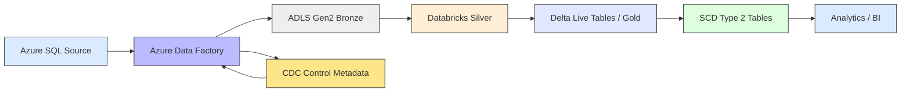
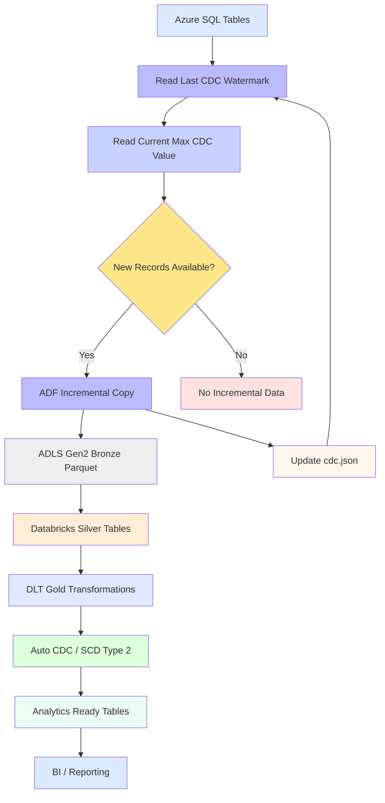
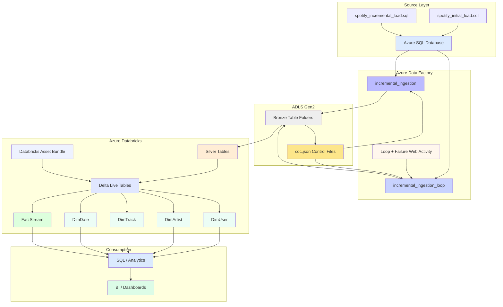
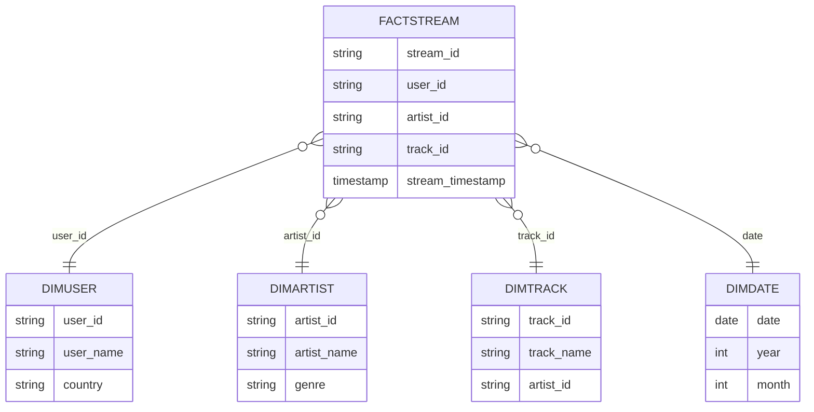

# Spotify Data Engineering Project


An end-to-end Azure data engineering project that incrementally ingests Spotify-style dimensional and fact data from Azure SQL, lands it in ADLS Gen2, and processes it in Databricks using streaming CDC patterns and SCD Type 2 transformations.

---

## Table of Contents

- [Project Overview](#project-overview)
- [Architecture](#architecture)
- [Technology Stack](#technology-stack)
- [Data Model](#data-model)
- [Incremental Ingestion](#incremental-ingestion-adf)
- [Databricks Processing](#databricks-processing)
- [Repository Structure](#repository-structure)
- [Deployment and Execution](#deployment-and-execution)
- [Testing and Quality](#testing-and-quality)
- [Productionization](#productionization-recommendations)
- [Future Enhancements](#future-enhancements)
- [Author](#author)

---

## Project Overview

This repository demonstrates a modern Azure-native data platform for music streaming analytics.

The pipeline combines:

- **Azure SQL Database** as the source system.
- **Azure Data Factory** for metadata-driven incremental ingestion.
- **ADLS Gen2** for Bronze landing and CDC control metadata.
- **Azure Databricks** for Silver and Gold processing.
- **Delta Live Tables** for streaming CDC and curated target tables.
- **SCD Type 2** handling for historical dimension and fact changes.
- **Databricks Asset Bundles** for repeatable deployment across environments.

Core business entities:

- `DimUser`
- `DimArtist`
- `DimTrack`
- `DimDate`
- `FactStream`

---

## Architecture

### High-Level Architecture



### End-to-End Data Flow



### Detailed Platform Architecture



### Architecture Notes

- **Azure SQL** contains the source dimensional and streaming data.
- **ADF** performs metadata-driven, watermark-based incremental extraction.
- **ADLS Bronze** stores each incremental batch as Parquet.
- **CDC metadata** is maintained in `cdc.json` files for table-level watermark tracking.
- **Databricks Silver** provides the curated processing layer.
- **DLT** builds streaming targets and applies automated CDC handling.
- **SCD Type 2** preserves historical changes for supported entities.
- **Asset Bundles** provide repeatable Databricks resource deployment.
- **Analytics / BI** consumes the curated Gold datasets.

---

## Technology Stack

| Layer | Technology |
|---|---|
| Source | Azure SQL Database |
| Ingestion | Azure Data Factory |
| Data Lake | Azure Data Lake Storage Gen2 |
| Processing | Azure Databricks |
| Transformation | Delta Live Tables |
| Language | Python / PySpark / SQL |
| Storage Format | Parquet / Delta |
| Change Data | CDC / Auto CDC |
| History | SCD Type 2 |
| Deployment | Databricks Asset Bundles |
| Testing | Pytest |

---

## Data Model

The project uses a star-schema-like structure:

### Dimensions

- `DimUser`
- `DimArtist`
- `DimTrack`
- `DimDate`

### Fact

- `FactStream`



> The diagram represents the logical model documented by the project. Exact physical column definitions should be validated against the deployed SQL and Databricks schemas.

---

## Incremental Ingestion (ADF)

The ADF layer implements watermark-based incremental ingestion for multiple tables.

### Processing Pattern

1. Read the previous CDC watermark from `bronze/<table>_CDC/cdc.json`.
2. Query Azure SQL using the table-specific CDC column.
3. Extract only rows where `cdc_col > last_watermark`.
4. Write the increment to `bronze/<table>/<timestamp>` in Parquet.
5. Calculate the latest source CDC value when rows are ingested.
6. Overwrite `cdc.json` with the latest watermark.
7. Remove empty landing artifacts when no rows are available.

### Pipeline Variants

- `pipeline/incremental_ingestion.json` - parameterized single-table ingestion.
- `pipeline/incremental_ingestion_loop.json` - metadata-driven multi-table ingestion.
- `pipeline/incremental_ingestion_loop_webactivity.json` - multi-table loop with failure callback handling.

The loop supports table-specific CDC columns such as `updated_at`, `date`, and `stream_timestamp`.

---

## Databricks Processing

The Gold transformation modules are located under:

`databricks/src/gold/dlt/transformations/`

### Processing Pattern

- Read streaming data from `spotify-catalog.silver.*` sources.
- Build streaming target tables for dimensions and facts.
- Apply `create_auto_cdc_flow(...)` for change processing.
- Use business keys and sequence columns for deterministic change application.
- Store changes as **SCD Type 2** where configured.

### Data Quality

`DimUser.py` includes a quality expectation that drops records where `user_id` is null.

---

## Repository Structure

```text
.
├── pipeline/
│   ├── incremental_ingestion.json
│   ├── incremental_ingestion_loop.json
│   └── incremental_ingestion_loop_webactivity.json
├── dataset/
│   └── ... ADF dataset definitions
├── linkedService/
│   └── ... Azure SQL and ADLS connections
├── files/
│   ├── cdc.json
│   └── empty.json
├── sql/
│   ├── spotify_initial_load.sql
│   └── spotify_incremental_load.sql
└── databricks/
    ├── resources/
    ├── src/gold/dlt/transformations/
    │   ├── DimArtist.py
    │   ├── DimDate.py
    │   ├── DimTrack.py
    │   ├── DimUser.py
    │   └── FactStream.py
    ├── tests/
    ├── pyproject.toml
    └── databricks.yml
```

---

## Deployment and Execution

### SQL Source Setup

Run the initial script once:

```bash
sql/spotify_initial_load.sql
```

Use the incremental script to simulate subsequent source arrivals:

```bash
sql/spotify_incremental_load.sql
```

### ADF Setup

1. Import linked services from `linkedService/`.
2. Import datasets from `dataset/`.
3. Import pipelines from `pipeline/`.
4. Create the initial CDC metadata files in ADLS.
5. Trigger the parameterized pipeline or multi-table loop.

### Databricks Setup

From the `databricks/` directory:

```bash
uv sync --dev
databricks bundle deploy --target dev
databricks bundle run
```

For production-style deployment:

```bash
databricks bundle deploy --target prod
```

---

## Testing and Quality

Run the included pytest tests:

```bash
cd databricks
uv run pytest
```

Recommended additional test coverage:

- CDC watermark progression.
- Duplicate and idempotent ingestion.
- Schema drift handling.
- SCD Type 2 history validation.
- Data quality expectation results.
- End-to-end Bronze to Gold verification.

---

## Productionization Recommendations

For production workloads, consider:

- Azure Key Vault and managed identities for secrets.
- Centralized monitoring for ADF and Databricks.
- Retry policies and pipeline failure notifications.
- Data quality scorecards and expectation monitoring.
- Partitioning and optimization for large `FactStream` volumes.
- Automated CI/CD for ADF artifacts and Databricks Bundles.
- Schema evolution and late-arriving data handling.
- Data lineage and governance through Unity Catalog.

---

## Future Enhancements

- Metadata-driven source configuration across additional domains.
- More robust late-arriving CDC handling.
- Automated data quality dashboards.
- Enhanced BI semantic modeling.
- Full CI/CD pipeline for Azure and Databricks components.
- Performance benchmarks for streaming and incremental workloads.

---

## Author

**Swapnil Take**  
Azure Data Engineer | Azure Data Factory | Azure Databricks | PySpark | SQL | ADLS Gen2 | Delta Lake
